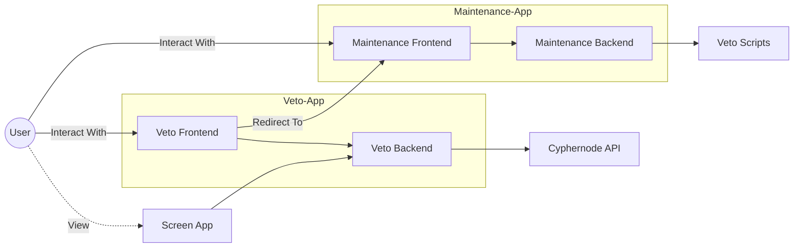
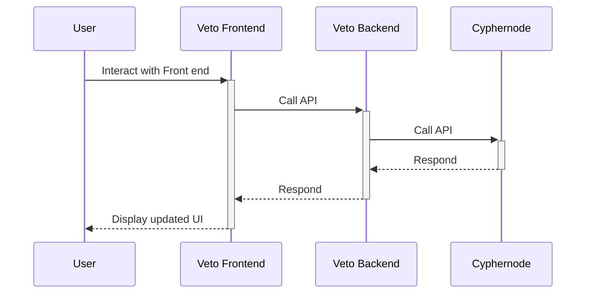
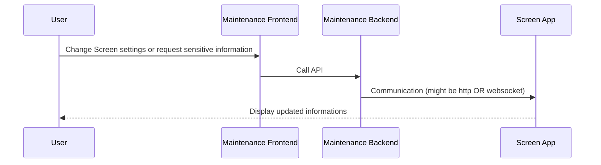

# Architecture

Research and development refers to innovative activities in developing or improving services or products. It constitutes the first stage of development of a potential new service or the production process.

## Key points

- Backend serve front-end as static content
- Aside from serving static content, the backend is purely an API

### Difference between dev & prod

#### Serving the front end

In dev, the front-end has its own server with `hot-reload` and `watch` capability. The backend serves it using a proxy.

In prod, the front-end is fully static. The backend statically serve theses files instead of using a proxy.

## Backend Structure

The folder structure is used to make a distinction between route implementation `api/*` and core server utils `server/*`
This has the effect of making tests easy as routes do not depend on server.

- `routes/` Contains veto routes, each file is a route veto-frontend can call to. \* `getActiveWatches.ts` handle the request (call upstream api, handle errors, format messages, etc)
- `api/` Contains api calls, sub-folders are grouped by upstream service
  - `cyphernode/` Group all calls to cyphernode, each file in this folder handle one call to cyphernode
    - `getActiveWatches.ts` make a `get` call to cyphernode `activewatches` endpoint
    - `client.ts` Provide an axios client with everything needed to call cyphernode
- `server/` Holds all core server code
  - `middlewares/` Group all middlewares used in this app, each file contain one middleware
    - `index.ts` Setup all middlewares in order
  - `serveFrontend.ts` (might be moved later) Serve static files. Used to serve veto-frontend
  - `index.ts` Brings all parts of the server together (middleware, api routes, serve frontend, etc)
- `utils/` Holds all utils used in the whole app (ex: config & logging)

## Communication

### Typical E2E communication

### E2E communication from Veto Screen

