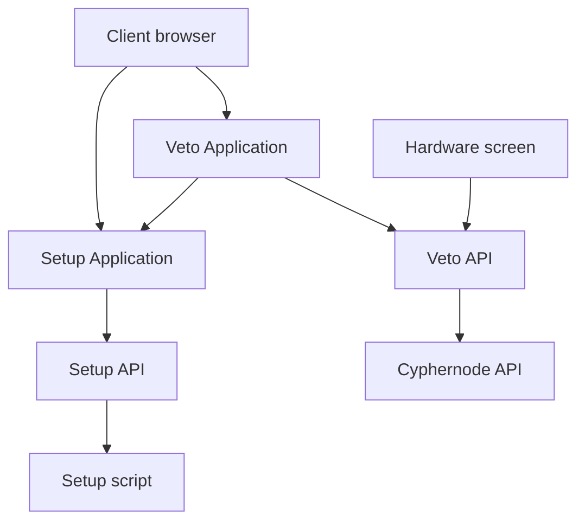

# Architecture

<svg id="mermaid-1584909364552" width="439.86669921875" xmlns="http://www.w3.org/2000/svg" height="409.1666259765625" viewBox="0 0 439.86669921875 409.1666259765625">
    
    <g transform="translate(0, 0)"><g class="output"><g class="clusters"></g><g class="edgePaths"><g class="edgePath" style="opacity: 1;"><path class="path" d="M143.7656823509882,46.633331298828125L172.64167022705078,71.63333129882812L172.64167022705078,96.63333129882812" marker-end="url(#arrowhead28)" style="fill:none"></path><defs><marker id="arrowhead28" viewBox="0 0 10 10" refX="9" refY="5" markerUnits="strokeWidth" markerWidth="8" markerHeight="6" orient="auto"><path d="M 0 0 L 10 5 L 0 10 z" class="arrowheadPath" style="stroke-width: 1px; stroke-dasharray: 1px, 0px;"></path></marker></defs></g><g class="edgePath" style="opacity: 1;"><path class="path" d="M209.32081609809347,135.26666259765625L256.7916717529297,160.26666259765625L309.9037460404521,185.26666259765625" marker-end="url(#arrowhead29)" style="fill:none"></path><defs><marker id="arrowhead29" viewBox="0 0 10 10" refX="9" refY="5" markerUnits="strokeWidth" markerWidth="8" markerHeight="6" orient="auto"><path d="M 0 0 L 10 5 L 0 10 z" class="arrowheadPath" style="stroke-width: 1px; stroke-dasharray: 1px, 0px;"></path></marker></defs></g><g class="edgePath" style="opacity: 1;"><path class="path" d="M350.9416732788086,223.89999389648438L350.9416732788086,248.89999389648438L350.9416732788086,273.8999938964844" marker-end="url(#arrowhead30)" style="fill:none"></path><defs><marker id="arrowhead30" viewBox="0 0 10 10" refX="9" refY="5" markerUnits="strokeWidth" markerWidth="8" markerHeight="6" orient="auto"><path d="M 0 0 L 10 5 L 0 10 z" class="arrowheadPath" style="stroke-width: 1px; stroke-dasharray: 1px, 0px;"></path></marker></defs></g><g class="edgePath" style="opacity: 1;"><path class="path" d="M360.9416732788086,135.26666259765625L360.9416732788086,160.26666259765625L355.3004546461224,185.26666259765625" marker-end="url(#arrowhead31)" style="fill:none"></path><defs><marker id="arrowhead31" viewBox="0 0 10 10" refX="9" refY="5" markerUnits="strokeWidth" markerWidth="8" markerHeight="6" orient="auto"><path d="M 0 0 L 10 5 L 0 10 z" class="arrowheadPath" style="stroke-width: 1px; stroke-dasharray: 1px, 0px;"></path></marker></defs></g><g class="edgePath" style="opacity: 1;"><path class="path" d="M99.14265810311338,46.633331298828125L70.26667022705078,71.63333129882812L70.26667022705078,115.94999694824219L70.26667022705078,160.26666259765625L75.907888859737,185.26666259765625" marker-end="url(#arrowhead32)" style="fill:none"></path><defs><marker id="arrowhead32" viewBox="0 0 10 10" refX="9" refY="5" markerUnits="strokeWidth" markerWidth="8" markerHeight="6" orient="auto"><path d="M 0 0 L 10 5 L 0 10 z" class="arrowheadPath" style="stroke-width: 1px; stroke-dasharray: 1px, 0px;"></path></marker></defs></g><g class="edgePath" style="opacity: 1;"><path class="path" d="M80.26667022705078,223.89999389648438L80.26667022705078,248.89999389648438L80.26667022705078,273.8999938964844" marker-end="url(#arrowhead33)" style="fill:none"></path><defs><marker id="arrowhead33" viewBox="0 0 10 10" refX="9" refY="5" markerUnits="strokeWidth" markerWidth="8" markerHeight="6" orient="auto"><path d="M 0 0 L 10 5 L 0 10 z" class="arrowheadPath" style="stroke-width: 1px; stroke-dasharray: 1px, 0px;"></path></marker></defs></g><g class="edgePath" style="opacity: 1;"><path class="path" d="M80.26667022705078,312.5333251953125L80.26667022705078,337.5333251953125L80.26667022705078,362.5333251953125" marker-end="url(#arrowhead34)" style="fill:none"></path><defs><marker id="arrowhead34" viewBox="0 0 10 10" refX="9" refY="5" markerUnits="strokeWidth" markerWidth="8" markerHeight="6" orient="auto"><path d="M 0 0 L 10 5 L 0 10 z" class="arrowheadPath" style="stroke-width: 1px; stroke-dasharray: 1px, 0px;"></path></marker></defs></g><g class="edgePath" style="opacity: 1;"><path class="path" d="M154.68893947042716,135.26666259765625L131.45417022705078,160.26666259765625L102.57818235098819,185.26666259765625" marker-end="url(#arrowhead35)" style="fill:none"></path><defs><marker id="arrowhead35" viewBox="0 0 10 10" refX="9" refY="5" markerUnits="strokeWidth" markerWidth="8" markerHeight="6" orient="auto"><path d="M 0 0 L 10 5 L 0 10 z" class="arrowheadPath" style="stroke-width: 1px; stroke-dasharray: 1px, 0px;"></path></marker></defs></g></g><g class="edgeLabels"><g class="edgeLabel" style="opacity: 1;" transform=""><g transform="translate(0,0)" class="label"><foreignObject width="0" height="0">

</foreignObject></g></g><g class="edgeLabel" style="opacity: 1;" transform=""><g transform="translate(0,0)" class="label"><foreignObject width="0" height="0">

</foreignObject></g></g><g class="edgeLabel" style="opacity: 1;" transform=""><g transform="translate(0,0)" class="label"><foreignObject width="0" height="0">

</foreignObject></g></g><g class="edgeLabel" style="opacity: 1;" transform=""><g transform="translate(0,0)" class="label"><foreignObject width="0" height="0">

</foreignObject></g></g><g class="edgeLabel" style="opacity: 1;" transform=""><g transform="translate(0,0)" class="label"><foreignObject width="0" height="0">

</foreignObject></g></g><g class="edgeLabel" style="opacity: 1;" transform=""><g transform="translate(0,0)" class="label"><foreignObject width="0" height="0">

</foreignObject></g></g><g class="edgeLabel" style="opacity: 1;" transform=""><g transform="translate(0,0)" class="label"><foreignObject width="0" height="0">

</foreignObject></g></g><g class="edgeLabel" style="opacity: 1;" transform=""><g transform="translate(0,0)" class="label"><foreignObject width="0" height="0">

</foreignObject></g></g></g><g class="nodes"><g class="node" style="opacity: 1;" id="client" transform="translate(121.45417022705078,27.316665649414062)"><rect rx="0" ry="0" x="-61.133331298828125" y="-19.316665649414062" width="122.26666259765625" height="38.633331298828125" class="label-container"></rect><g class="label" transform="translate(0,0)"><g transform="translate(-51.133331298828125,-9.316665649414062)"><foreignObject width="102.26666259765625" height="18.633331298828125">
Client browser
</foreignObject></g></g></g><g class="node" style="opacity: 1;" id="vetoFE" transform="translate(172.64167022705078,115.94999694824219)"><rect rx="0" ry="0" x="-67.375" y="-19.316665649414062" width="134.75" height="38.633331298828125" class="label-container"></rect><g class="label" transform="translate(0,0)"><g transform="translate(-57.375,-9.316665649414062)"><foreignObject width="114.75" height="18.633331298828125">
Veto Application
</foreignObject></g></g></g><g class="node" style="opacity: 1;" id="vetoBE" transform="translate(350.9416732788086,204.5833282470703)"><rect rx="0" ry="0" x="-41.133331298828125" y="-19.316665649414062" width="82.26666259765625" height="38.633331298828125" class="label-container"></rect><g class="label" transform="translate(0,0)"><g transform="translate(-31.133331298828125,-9.316665649414062)"><foreignObject width="62.26666259765625" height="18.633331298828125">
Veto API
</foreignObject></g></g></g><g class="node" style="opacity: 1;" id="vetoScreen" transform="translate(360.9416732788086,115.94999694824219)"><rect rx="0" ry="0" x="-70.92500305175781" y="-19.316665649414062" width="141.85000610351562" height="38.633331298828125" class="label-container"></rect><g class="label" transform="translate(0,0)"><g transform="translate(-60.92500305175781,-9.316665649414062)"><foreignObject width="121.85000610351562" height="18.633331298828125">
Hardware screen
</foreignObject></g></g></g><g class="node" style="opacity: 1;" id="vetoSetupFE" transform="translate(80.26667022705078,204.5833282470703)"><rect rx="0" ry="0" x="-72.26667022705078" y="-19.316665649414062" width="144.53334045410156" height="38.633331298828125" class="label-container"></rect><g class="label" transform="translate(0,0)"><g transform="translate(-62.26667022705078,-9.316665649414062)"><foreignObject width="124.53334045410156" height="18.633331298828125">
Setup Application
</foreignObject></g></g></g><g class="node" style="opacity: 1;" id="vetoSetupBE" transform="translate(80.26667022705078,293.21665954589844)"><rect rx="0" ry="0" x="-46.025001525878906" y="-19.316665649414062" width="92.05000305175781" height="38.633331298828125" class="label-container"></rect><g class="label" transform="translate(0,0)"><g transform="translate(-36.025001525878906,-9.316665649414062)"><foreignObject width="72.05000305175781" height="18.633331298828125">
Setup API
</foreignObject></g></g></g><g class="node" style="opacity: 1;" id="vetoSetup" transform="translate(80.26667022705078,381.84999084472656)"><rect rx="0" ry="0" x="-52.25" y="-19.316665649414062" width="104.5" height="38.633331298828125" class="label-container"></rect><g class="label" transform="translate(0,0)"><g transform="translate(-42.25,-9.316665649414062)"><foreignObject width="84.5" height="18.633331298828125">
Setup script
</foreignObject></g></g></g><g class="node" style="opacity: 1;" id="cyphernode" transform="translate(350.9416732788086,293.21665954589844)"><rect rx="0" ry="0" x="-68.70833587646484" y="-19.316665649414062" width="137.4166717529297" height="38.633331298828125" class="label-container"></rect><g class="label" transform="translate(0,0)"><g transform="translate(-58.708335876464844,-9.316665649414062)"><foreignObject width="117.41667175292969" height="18.633331298828125">
Cyphernode API
</foreignObject></g></g></g></g></g></g>
</svg>

## Key points

- Backend serve front-end as static content
- Aside from serving static content, the backend is purely an API

### Difference between dev & prod

#### Serving the front end

In dev, the front-end has its own server with `hot-reload` and `watch` capability. The backend serves it using a proxy.

In prod, the front-end is fully static. The backend statically serve theses files instead of using a proxy.

## Backend Structure

The folder structure is used to make a distinction between route implementation `api/*` and core server utils `server/*`
This has the effect of making tests easy as routes do not depend on server.

- `routes/` Contains veto routes, each file is a route veto-frontend can call to. \* `getActiveWatches.ts` handle the request (call upstream api, handle errors, format messages, etc)
- `api/` Contains api calls, sub-folders are grouped by upstream service
  - `cyphernode/` Group all calls to cyphernode, each file in this folder handle one call to cyphernode
    - `getActiveWatches.ts` make a `get` call to cyphernode `activewatches` endpoint
    - `client.ts` Provide an axios client with everything needed to call cyphernode
- `server/` Holds all core server code
  - `middlewares/` Group all middlewares used in this app, each file contain one middleware
    - `index.ts` Setup all middlewares in order
  - `serveFrontend.ts` (might be moved later) Serve static files. Used to serve veto-frontend
  - `index.ts` Brings all parts of the server together (middleware, api routes, serve frontend, etc)
- `utils/` Holds all utils used in the whole app (ex: config & logging)
