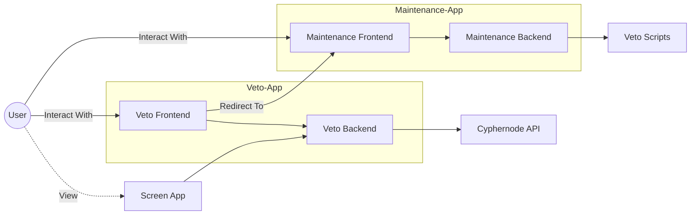
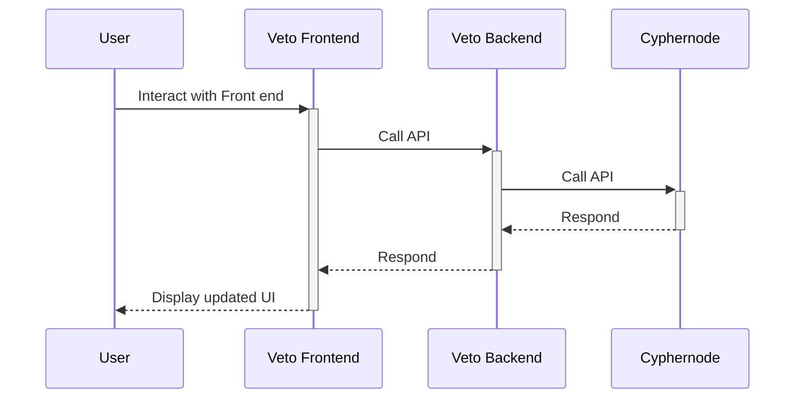
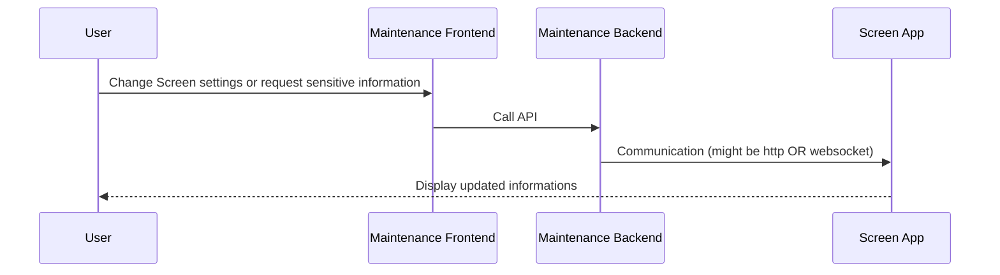

# Architecture

Research and development refers to innovative activities in developing or improving services or products. It constitutes the first stage of development of a potential new service or the production process.

<svg id="mermaid-1585416748728" width="1124.949951171875" xmlns="http://www.w3.org/2000/svg" height="353.7166748046875" viewBox="0 0 1124.949951171875 353.7166748046875">
<g transform="translate(0, 0)"><g class="output"><g class="clusters"><g class="cluster" id="Veto-App" style="opacity: 1;" transform="translate(454.9166793823242,204.35832977294922)"><rect width="506.59999084472656" height="135.4499969482422" x="-253.29999542236328" y="-67.7249984741211"></rect><g class="label" transform="translate(0, -53.724998474121094)" id="mermaid-1585416748728Text"><g transform="translate(-32.916664123535156,-9.316665649414062)"><foreignObject width="65.83332824707031" height="18.633331298828125">
Veto-App
</foreignObject></g></g></g><g class="cluster" id="Maintenance-App" style="opacity: 1;" transform="translate(719.8250122070312,62.31666564941406)"><rect width="483.48333740234375" height="108.63333129882812" x="-241.74166870117188" y="-54.31666564941406"></rect><g class="label" transform="translate(0, -40.31666564941406)" id="mermaid-1585416748728Text"><g transform="translate(-62.71666717529297,-9.316665649414062)"><foreignObject width="125.43333435058594" height="18.633331298828125">
Maintenance-App
</foreignObject></g></g></g></g><g class="edgePaths"><g class="edgePath" style="opacity: 1;"><path class="path" d="M50.89039587342546,171.4934574556654L131.70001220703125,62.31666564941406L201.61668395996094,62.31666564941406L286.8833541870117,62.31666564941406L412.61668395996094,62.31666564941406L478.0833435058594,62.31666564941406L503.0833435058594,62.31666564941406" marker-end="url(#arrowhead79)" style="fill:none"></path><defs><marker id="arrowhead79" viewBox="0 0 10 10" refX="9" refY="5" markerUnits="strokeWidth" markerWidth="8" markerHeight="6" orient="auto"><path d="M 0 0 L 10 5 L 0 10 z" class="arrowheadPath" style="stroke-width: 1px; stroke-dasharray: 1px, 0px;"></path></marker></defs></g><g class="edgePath" style="opacity: 1;"><path class="path" d="M683.2166748046875,62.31666564941406L708.2166748046875,62.31666564941406L733.2166748046875,62.31666564941406L758.2166748046875,62.31666564941406" marker-end="url(#arrowhead80)" style="fill:none"></path><defs><marker id="arrowhead80" viewBox="0 0 10 10" refX="9" refY="5" markerUnits="strokeWidth" markerWidth="8" markerHeight="6" orient="auto"><path d="M 0 0 L 10 5 L 0 10 z" class="arrowheadPath" style="stroke-width: 1px; stroke-dasharray: 1px, 0px;"></path></marker></defs></g><g class="edgePath" style="opacity: 1;"><path class="path" d="M936.5666809082031,62.31666564941406L961.5666809082031,62.31666564941406L986.5666809082031,62.31666564941406L1011.5666809082031,62.31666564941406" marker-end="url(#arrowhead81)" style="fill:none"></path><defs><marker id="arrowhead81" viewBox="0 0 10 10" refX="9" refY="5" markerUnits="strokeWidth" markerWidth="8" markerHeight="6" orient="auto"><path d="M 0 0 L 10 5 L 0 10 z" class="arrowheadPath" style="stroke-width: 1px; stroke-dasharray: 1px, 0px;"></path></marker></defs></g><g class="edgePath" style="opacity: 1;"><path class="path" d="M61.78334045410156,193.10832977294922L131.70001220703125,193.10832977294922L201.61668395996094,193.10832977294922L226.61668395996094,193.10832977294922" marker-end="url(#arrowhead82)" style="fill:none"></path><defs><marker id="arrowhead82" viewBox="0 0 10 10" refX="9" refY="5" markerUnits="strokeWidth" markerWidth="8" markerHeight="6" orient="auto"><path d="M 0 0 L 10 5 L 0 10 z" class="arrowheadPath" style="stroke-width: 1px; stroke-dasharray: 1px, 0px;"></path></marker></defs></g><g class="edgePath" style="opacity: 1;"><path class="path" d="M347.1500244140625,200.13438175153152L412.61668395996094,207.76666259765625L478.0833435058594,207.76666259765625L533.7750091552734,212.60661040835373" marker-end="url(#arrowhead83)" style="fill:none"></path><defs><marker id="arrowhead83" viewBox="0 0 10 10" refX="9" refY="5" markerUnits="strokeWidth" markerWidth="8" markerHeight="6" orient="auto"><path d="M 0 0 L 10 5 L 0 10 z" class="arrowheadPath" style="stroke-width: 1px; stroke-dasharray: 1px, 0px;"></path></marker></defs></g><g class="edgePath" style="opacity: 1;"><path class="path" d="M347.1500244140625,186.08227779436692L412.61668395996094,178.4499969482422L478.0833435058594,178.4499969482422L574.0107639197837,81.63333129882812" marker-end="url(#arrowhead84)" style="fill:none"></path><defs><marker id="arrowhead84" viewBox="0 0 10 10" refX="9" refY="5" markerUnits="strokeWidth" markerWidth="8" markerHeight="6" orient="auto"><path d="M 0 0 L 10 5 L 0 10 z" class="arrowheadPath" style="stroke-width: 1px; stroke-dasharray: 1px, 0px;"></path></marker></defs></g><g class="edgePath" style="opacity: 1;"><path class="path" d="M652.5250091552734,217.76666259765625L708.2166748046875,217.76666259765625L733.2166748046875,217.76666259765625L778.6833419799805,217.76666259765625" marker-end="url(#arrowhead85)" style="fill:none"></path><defs><marker id="arrowhead85" viewBox="0 0 10 10" refX="9" refY="5" markerUnits="strokeWidth" markerWidth="8" markerHeight="6" orient="auto"><path d="M 0 0 L 10 5 L 0 10 z" class="arrowheadPath" style="stroke-width: 1px; stroke-dasharray: 1px, 0px;"></path></marker></defs></g><g class="edgePath" style="opacity: 1;"><path class="path" d="M50.69459441623941,214.86676525602581L131.70001220703125,326.3999938964844L201.61668395996094,326.3999938964844L235.07501983642578,326.3999938964844" marker-end="url(#arrowhead86)" style="fill:none;stroke-width:2px;stroke-dasharray:3;"></path><defs><marker id="arrowhead86" viewBox="0 0 10 10" refX="9" refY="5" markerUnits="strokeWidth" markerWidth="8" markerHeight="6" orient="auto"><path d="M 0 0 L 10 5 L 0 10 z" class="arrowheadPath" style="stroke-width: 1px; stroke-dasharray: 1px, 0px;"></path></marker></defs></g><g class="edgePath" style="opacity: 1;"><path class="path" d="M313.4343105436679,307.0833282470703L412.61668395996094,234.92499542236328L478.0833435058594,234.92499542236328L533.7750091552734,226.62045188334733" marker-end="url(#arrowhead87)" style="fill:none"></path><defs><marker id="arrowhead87" viewBox="0 0 10 10" refX="9" refY="5" markerUnits="strokeWidth" markerWidth="8" markerHeight="6" orient="auto"><path d="M 0 0 L 10 5 L 0 10 z" class="arrowheadPath" style="stroke-width: 1px; stroke-dasharray: 1px, 0px;"></path></marker></defs></g></g><g class="edgeLabels"><g class="edgeLabel" style="opacity: 1;" transform="translate(286.8833541870117,62.31666564941406)"><g transform="translate(-44.91667175292969,-9.316665649414062)" class="label"><foreignObject width="89.83334350585938" height="18.633331298828125">
Interact With
</foreignObject></g></g><g class="edgeLabel" style="opacity: 1;" transform=""><g transform="translate(0,0)" class="label"><foreignObject width="0" height="0">

</foreignObject></g></g><g class="edgeLabel" style="opacity: 1;" transform=""><g transform="translate(0,0)" class="label"><foreignObject width="0" height="0">

</foreignObject></g></g><g class="edgeLabel" style="opacity: 1;" transform="translate(131.70001220703125,193.10832977294922)"><g transform="translate(-44.91667175292969,-9.316665649414062)" class="label"><foreignObject width="89.83334350585938" height="18.633331298828125">
Interact With
</foreignObject></g></g><g class="edgeLabel" style="opacity: 1;" transform=""><g transform="translate(0,0)" class="label"><foreignObject width="0" height="0">

</foreignObject></g></g><g class="edgeLabel" style="opacity: 1;" transform="translate(412.61668395996094,178.4499969482422)"><g transform="translate(-40.46665954589844,-9.316665649414062)" class="label"><foreignObject width="80.93331909179688" height="18.633331298828125">
Redirect To
</foreignObject></g></g><g class="edgeLabel" style="opacity: 1;" transform=""><g transform="translate(0,0)" class="label"><foreignObject width="0" height="0">

</foreignObject></g></g><g class="edgeLabel" style="opacity: 1;" transform="translate(131.70001220703125,326.3999938964844)"><g transform="translate(-17.191665649414062,-9.316665649414062)" class="label"><foreignObject width="34.383331298828125" height="18.633331298828125">
View
</foreignObject></g></g><g class="edgeLabel" style="opacity: 1;" transform=""><g transform="translate(0,0)" class="label"><foreignObject width="0" height="0">

</foreignObject></g></g></g><g class="nodes"><g class="node" style="opacity: 1;" id="vetoBE" transform="translate(593.1500091552734,217.76666259765625)"><rect rx="0" ry="0" x="-59.375" y="-19.316665649414062" width="118.75" height="38.633331298828125" class="label-container"></rect><g class="label" transform="translate(0,0)"><g transform="translate(-49.375,-9.316665649414062)"><foreignObject width="98.75" height="18.633331298828125">
Veto Backend
</foreignObject></g></g></g><g class="node" style="opacity: 1;" id="vetoFE" transform="translate(286.8833541870117,193.10832977294922)"><rect rx="0" ry="0" x="-60.26667022705078" y="-19.316665649414062" width="120.53334045410156" height="38.633331298828125" class="label-container"></rect><g class="label" transform="translate(0,0)"><g transform="translate(-50.26667022705078,-9.316665649414062)"><foreignObject width="100.53334045410156" height="18.633331298828125">
Veto Frontend
</foreignObject></g></g></g><g class="node" style="opacity: 1;" id="maintenanceFE" transform="translate(593.1500091552734,62.31666564941406)"><rect rx="0" ry="0" x="-90.06666564941406" y="-19.316665649414062" width="180.13333129882812" height="38.633331298828125" class="label-container"></rect><g class="label" transform="translate(0,0)"><g transform="translate(-80.06666564941406,-9.316665649414062)"><foreignObject width="160.13333129882812" height="18.633331298828125">
Maintenance Frontend
</foreignObject></g></g></g><g class="node" style="opacity: 1;" id="maintenanceBE" transform="translate(847.3916778564453,62.31666564941406)"><rect rx="0" ry="0" x="-89.17500305175781" y="-19.316665649414062" width="178.35000610351562" height="38.633331298828125" class="label-container"></rect><g class="label" transform="translate(0,0)"><g transform="translate(-79.17500305175781,-9.316665649414062)"><foreignObject width="158.35000610351562" height="18.633331298828125">
Maintenance Backend
</foreignObject></g></g></g><g class="node" style="opacity: 1;" id="user" transform="translate(34.89167022705078,193.10832977294922)"><circle x="-26.89167022705078" y="-19.316665649414062" r="26.89167022705078" class="label-container"></circle><g class="label" transform="translate(0,0)"><g transform="translate(-16.89167022705078,-9.316665649414062)"><foreignObject width="33.78334045410156" height="18.633331298828125">
User
</foreignObject></g></g></g><g class="node" style="opacity: 1;" id="vetoScreen" transform="translate(286.8833541870117,326.3999938964844)"><rect rx="0" ry="0" x="-51.80833435058594" y="-19.316665649414062" width="103.61666870117188" height="38.633331298828125" class="label-container"></rect><g class="label" transform="translate(0,0)"><g transform="translate(-41.80833435058594,-9.316665649414062)"><foreignObject width="83.61666870117188" height="18.633331298828125">
Screen App
</foreignObject></g></g></g><g class="node" style="opacity: 1;" id="scripts" transform="translate(1064.2583465576172,62.31666564941406)"><rect rx="0" ry="0" x="-52.69166564941406" y="-19.316665649414062" width="105.38333129882812" height="38.633331298828125" class="label-container"></rect><g class="label" transform="translate(0,0)"><g transform="translate(-42.69166564941406,-9.316665649414062)"><foreignObject width="85.38333129882812" height="18.633331298828125">
Veto Scripts
</foreignObject></g></g></g><g class="node" style="opacity: 1;" id="cyphernode" transform="translate(847.3916778564453,217.76666259765625)"><rect rx="0" ry="0" x="-68.70833587646484" y="-19.316665649414062" width="137.4166717529297" height="38.633331298828125" class="label-container"></rect><g class="label" transform="translate(0,0)"><g transform="translate(-58.708335876464844,-9.316665649414062)"><foreignObject width="117.41667175292969" height="18.633331298828125">
Cyphernode API
</foreignObject></g></g></g></g></g></g>
</svg>

## Key points

- Backend serve front-end as static content
- Aside from serving static content, the backend is purely an API

### Difference between dev & prod

#### Serving the front end

In dev, the front-end has its own server with `hot-reload` and `watch` capability. The backend serves it using a proxy.

In prod, the front-end is fully static. The backend statically serve theses files instead of using a proxy.

## Backend Structure

The folder structure is used to make a distinction between route implementation `api/*` and core server utils `server/*`
This has the effect of making tests easy as routes do not depend on server.

- `routes/` Contains veto routes, each file is a route veto-frontend can call to. \* `getActiveWatches.ts` handle the request (call upstream api, handle errors, format messages, etc)
- `api/` Contains api calls, sub-folders are grouped by upstream service
  - `cyphernode/` Group all calls to cyphernode, each file in this folder handle one call to cyphernode
    - `getActiveWatches.ts` make a `get` call to cyphernode `activewatches` endpoint
    - `client.ts` Provide an axios client with everything needed to call cyphernode
- `server/` Holds all core server code
  - `middlewares/` Group all middlewares used in this app, each file contain one middleware
    - `index.ts` Setup all middlewares in order
  - `serveFrontend.ts` (might be moved later) Serve static files. Used to serve veto-frontend
  - `index.ts` Brings all parts of the server together (middleware, api routes, serve frontend, etc)
- `utils/` Holds all utils used in the whole app (ex: config & logging)

## Communication

### Typical E2E communication

<svg id="mermaid-1585413870844" width="100%" xmlns="http://www.w3.org/2000/svg" height="100%" style="max-width:850px;" viewBox="-50 -10 850 371">
      <g></g><g><line id="actor0" x1="75" y1="5" x2="75" y2="360" class="actor-line" stroke-width="0.5px" stroke="#999"></line><rect x="0" y="0" fill="#eaeaea" stroke="#666" width="150" height="65" rx="3" ry="3" class="actor"></rect><text x="75" y="32.5" style="text-anchor: middle;" dominant-baseline="central" alignment-baseline="central" class="actor"><tspan x="75" dy="0">User</tspan></text></g><g><line id="actor1" x1="275" y1="5" x2="275" y2="360" class="actor-line" stroke-width="0.5px" stroke="#999"></line><rect x="200" y="0" fill="#eaeaea" stroke="#666" width="150" height="65" rx="3" ry="3" class="actor"></rect><text x="275" y="32.5" style="text-anchor: middle;" dominant-baseline="central" alignment-baseline="central" class="actor"><tspan x="275" dy="0">Veto Frontend</tspan></text></g><g><line id="actor2" x1="475" y1="5" x2="475" y2="360" class="actor-line" stroke-width="0.5px" stroke="#999"></line><rect x="400" y="0" fill="#eaeaea" stroke="#666" width="150" height="65" rx="3" ry="3" class="actor"></rect><text x="475" y="32.5" style="text-anchor: middle;" dominant-baseline="central" alignment-baseline="central" class="actor"><tspan x="475" dy="0">Veto Backend</tspan></text></g><g><line id="actor3" x1="675" y1="5" x2="675" y2="360" class="actor-line" stroke-width="0.5px" stroke="#999"></line><rect x="600" y="0" fill="#eaeaea" stroke="#666" width="150" height="65" rx="3" ry="3" class="actor"></rect><text x="675" y="32.5" style="text-anchor: middle;" dominant-baseline="central" alignment-baseline="central" class="actor"><tspan x="675" dy="0">Cyphernode</tspan></text></g><defs><marker id="arrowhead" refX="5" refY="2" markerWidth="6" markerHeight="4" orient="auto"><path d="M 0,0 V 4 L6,2 Z"></path></marker></defs><defs><marker id="crosshead" markerWidth="15" markerHeight="8" orient="auto" refX="16" refY="4"><path fill="black" stroke="#000000" style="stroke-dasharray: 0px, 0px;" stroke-width="1px" d="M 9,2 V 6 L16,4 Z"></path><path fill="none" stroke="#000000" style="stroke-dasharray: 0px, 0px;" stroke-width="1px" d="M 0,1 L 6,7 M 6,1 L 0,7"></path></marker></defs><defs><marker id="sequencenumber" refX="15" refY="15" markerWidth="60" markerHeight="40" orient="auto"><circle cx="15" cy="15" r="6"></circle></marker></defs><g><text x="175" y="93" style="text-anchor: middle;" class="messageText">Interact with Front end</text><line x1="75" y1="100" x2="275" y2="100" class="messageLine0" stroke-width="2" stroke="black" style="fill: none;" marker-end="url(#arrowhead)"></line></g><g><rect x="270" y="102" fill="#EDF2AE" stroke="#666" width="10" height="173" rx="0" ry="0" class="activation0"></rect></g><g><text x="377.5" y="128" style="text-anchor: middle;" class="messageText">Call API</text><line x1="280" y1="135" x2="475" y2="135" class="messageLine0" stroke-width="2" stroke="black" style="fill: none;" marker-end="url(#arrowhead)"></line></g><g><rect x="470" y="137" fill="#EDF2AE" stroke="#666" width="10" height="103" rx="0" ry="0" class="activation0"></rect></g><g><text x="577.5" y="163" style="text-anchor: middle;" class="messageText">Call API</text><line x1="480" y1="170" x2="675" y2="170" class="messageLine0" stroke-width="2" stroke="black" style="fill: none;" marker-end="url(#arrowhead)"></line></g><g><rect x="670" y="172" fill="#EDF2AE" stroke="#666" width="10" height="33" rx="0" ry="0" class="activation0"></rect></g><g><text x="575" y="198" style="text-anchor: middle;" class="messageText">Respond</text><line x1="670" y1="205" x2="480" y2="205" style="stroke-dasharray: 3px, 3px; fill: none;" class="messageLine1" stroke-width="2" stroke="black" marker-end="url(#arrowhead)"></line></g><g><text x="375" y="233" style="text-anchor: middle;" class="messageText">Respond</text><line x1="470" y1="240" x2="280" y2="240" style="stroke-dasharray: 3px, 3px; fill: none;" class="messageLine1" stroke-width="2" stroke="black" marker-end="url(#arrowhead)"></line></g><g><text x="172.5" y="268" style="text-anchor: middle;" class="messageText">Display updated UI</text><line x1="270" y1="275" x2="75" y2="275" style="stroke-dasharray: 3px, 3px; fill: none;" class="messageLine1" stroke-width="2" stroke="black" marker-end="url(#arrowhead)"></line></g><g><rect x="0" y="295" fill="#eaeaea" stroke="#666" width="150" height="65" rx="3" ry="3" class="actor"></rect><text x="75" y="327.5" style="text-anchor: middle;" dominant-baseline="central" alignment-baseline="central" class="actor"><tspan x="75" dy="0">User</tspan></text></g><g><rect x="200" y="295" fill="#eaeaea" stroke="#666" width="150" height="65" rx="3" ry="3" class="actor"></rect><text x="275" y="327.5" style="text-anchor: middle;" dominant-baseline="central" alignment-baseline="central" class="actor"><tspan x="275" dy="0">Veto Frontend</tspan></text></g><g><rect x="400" y="295" fill="#eaeaea" stroke="#666" width="150" height="65" rx="3" ry="3" class="actor"></rect><text x="475" y="327.5" style="text-anchor: middle;" dominant-baseline="central" alignment-baseline="central" class="actor"><tspan x="475" dy="0">Veto Backend</tspan></text></g><g><rect x="600" y="295" fill="#eaeaea" stroke="#666" width="150" height="65" rx="3" ry="3" class="actor"></rect><text x="675" y="327.5" style="text-anchor: middle;" dominant-baseline="central" alignment-baseline="central" class="actor"><tspan x="675" dy="0">Cyphernode</tspan></text></g></svg><svg id="mermaid-1585413870844" width="100%" xmlns="http://www.w3.org/2000/svg" height="100%" style="max-width:850px;" viewBox="-50 -10 850 371"><g></g><g><line id="actor0" x1="75" y1="5" x2="75" y2="360" class="actor-line" stroke-width="0.5px" stroke="#999"></line><rect x="0" y="0" fill="#eaeaea" stroke="#666" width="150" height="65" rx="3" ry="3" class="actor"></rect><text x="75" y="32.5" style="text-anchor: middle;" dominant-baseline="central" alignment-baseline="central" class="actor"><tspan x="75" dy="0">User</tspan></text></g><g><line id="actor1" x1="275" y1="5" x2="275" y2="360" class="actor-line" stroke-width="0.5px" stroke="#999"></line><rect x="200" y="0" fill="#eaeaea" stroke="#666" width="150" height="65" rx="3" ry="3" class="actor"></rect><text x="275" y="32.5" style="text-anchor: middle;" dominant-baseline="central" alignment-baseline="central" class="actor"><tspan x="275" dy="0">Veto Frontend</tspan></text></g><g><line id="actor2" x1="475" y1="5" x2="475" y2="360" class="actor-line" stroke-width="0.5px" stroke="#999"></line><rect x="400" y="0" fill="#eaeaea" stroke="#666" width="150" height="65" rx="3" ry="3" class="actor"></rect><text x="475" y="32.5" style="text-anchor: middle;" dominant-baseline="central" alignment-baseline="central" class="actor"><tspan x="475" dy="0">Veto Backend</tspan></text></g><g><line id="actor3" x1="675" y1="5" x2="675" y2="360" class="actor-line" stroke-width="0.5px" stroke="#999"></line><rect x="600" y="0" fill="#eaeaea" stroke="#666" width="150" height="65" rx="3" ry="3" class="actor"></rect><text x="675" y="32.5" style="text-anchor: middle;" dominant-baseline="central" alignment-baseline="central" class="actor"><tspan x="675" dy="0">Cyphernode</tspan></text></g><defs><marker id="arrowhead" refX="5" refY="2" markerWidth="6" markerHeight="4" orient="auto"><path d="M 0,0 V 4 L6,2 Z"></path></marker></defs><defs><marker id="crosshead" markerWidth="15" markerHeight="8" orient="auto" refX="16" refY="4"><path fill="black" stroke="#000000" style="stroke-dasharray: 0px, 0px;" stroke-width="1px" d="M 9,2 V 6 L16,4 Z"></path><path fill="none" stroke="#000000" style="stroke-dasharray: 0px, 0px;" stroke-width="1px" d="M 0,1 L 6,7 M 6,1 L 0,7"></path></marker></defs><defs><marker id="sequencenumber" refX="15" refY="15" markerWidth="60" markerHeight="40" orient="auto"><circle cx="15" cy="15" r="6"></circle></marker></defs><g><text x="175" y="93" style="text-anchor: middle;" class="messageText">Interact with Front end</text><line x1="75" y1="100" x2="275" y2="100" class="messageLine0" stroke-width="2" stroke="black" style="fill: none;" marker-end="url(#arrowhead)"></line></g><g><rect x="270" y="102" fill="#EDF2AE" stroke="#666" width="10" height="173" rx="0" ry="0" class="activation0"></rect></g><g><text x="377.5" y="128" style="text-anchor: middle;" class="messageText">Call API</text><line x1="280" y1="135" x2="475" y2="135" class="messageLine0" stroke-width="2" stroke="black" style="fill: none;" marker-end="url(#arrowhead)"></line></g><g><rect x="470" y="137" fill="#EDF2AE" stroke="#666" width="10" height="103" rx="0" ry="0" class="activation0"></rect></g><g><text x="577.5" y="163" style="text-anchor: middle;" class="messageText">Call API</text><line x1="480" y1="170" x2="675" y2="170" class="messageLine0" stroke-width="2" stroke="black" style="fill: none;" marker-end="url(#arrowhead)"></line></g><g><rect x="670" y="172" fill="#EDF2AE" stroke="#666" width="10" height="33" rx="0" ry="0" class="activation0"></rect></g><g><text x="575" y="198" style="text-anchor: middle;" class="messageText">Respond</text><line x1="670" y1="205" x2="480" y2="205" style="stroke-dasharray: 3px, 3px; fill: none;" class="messageLine1" stroke-width="2" stroke="black" marker-end="url(#arrowhead)"></line></g><g><text x="375" y="233" style="text-anchor: middle;" class="messageText">Respond</text><line x1="470" y1="240" x2="280" y2="240" style="stroke-dasharray: 3px, 3px; fill: none;" class="messageLine1" stroke-width="2" stroke="black" marker-end="url(#arrowhead)"></line></g><g><text x="172.5" y="268" style="text-anchor: middle;" class="messageText">Display updated UI</text><line x1="270" y1="275" x2="75" y2="275" style="stroke-dasharray: 3px, 3px; fill: none;" class="messageLine1" stroke-width="2" stroke="black" marker-end="url(#arrowhead)"></line></g><g><rect x="0" y="295" fill="#eaeaea" stroke="#666" width="150" height="65" rx="3" ry="3" class="actor"></rect><text x="75" y="327.5" style="text-anchor: middle;" dominant-baseline="central" alignment-baseline="central" class="actor"><tspan x="75" dy="0">User</tspan></text></g><g><rect x="200" y="295" fill="#eaeaea" stroke="#666" width="150" height="65" rx="3" ry="3" class="actor"></rect><text x="275" y="327.5" style="text-anchor: middle;" dominant-baseline="central" alignment-baseline="central" class="actor"><tspan x="275" dy="0">Veto Frontend</tspan></text></g><g><rect x="400" y="295" fill="#eaeaea" stroke="#666" width="150" height="65" rx="3" ry="3" class="actor"></rect><text x="475" y="327.5" style="text-anchor: middle;" dominant-baseline="central" alignment-baseline="central" class="actor"><tspan x="475" dy="0">Veto Backend</tspan></text></g><g><rect x="600" y="295" fill="#eaeaea" stroke="#666" width="150" height="65" rx="3" ry="3" class="actor"></rect><text x="675" y="327.5" style="text-anchor: middle;" dominant-baseline="central" alignment-baseline="central" class="actor"><tspan x="675" dy="0">Cyphernode</tspan></text></g>
</svg>

### E2E communication from Veto Screen

<svg id="mermaid-1585416869664" width="100%" xmlns="http://www.w3.org/2000/svg" height="100%" style="max-width:850px;" viewBox="-50 -10 850 301">
    <g></g><g><line id="actor3368" x1="75" y1="5" x2="75" y2="290" class="actor-line" stroke-width="0.5px" stroke="#999"></line><rect x="0" y="0" fill="#eaeaea" stroke="#666" width="150" height="65" rx="3" ry="3" class="actor"></rect><text x="75" y="32.5" style="text-anchor: middle;" dominant-baseline="central" alignment-baseline="central" class="actor"><tspan x="75" dy="0">User</tspan></text></g><g><line id="actor3369" x1="275" y1="5" x2="275" y2="290" class="actor-line" stroke-width="0.5px" stroke="#999"></line><rect x="200" y="0" fill="#eaeaea" stroke="#666" width="150" height="65" rx="3" ry="3" class="actor"></rect><text x="275" y="32.5" style="text-anchor: middle;" dominant-baseline="central" alignment-baseline="central" class="actor"><tspan x="275" dy="0">Maintenance Frontend</tspan></text></g><g><line id="actor3370" x1="475" y1="5" x2="475" y2="290" class="actor-line" stroke-width="0.5px" stroke="#999"></line><rect x="400" y="0" fill="#eaeaea" stroke="#666" width="150" height="65" rx="3" ry="3" class="actor"></rect><text x="475" y="32.5" style="text-anchor: middle;" dominant-baseline="central" alignment-baseline="central" class="actor"><tspan x="475" dy="0">Maintenance Backend</tspan></text></g><g><line id="actor3371" x1="675" y1="5" x2="675" y2="290" class="actor-line" stroke-width="0.5px" stroke="#999"></line><rect x="600" y="0" fill="#eaeaea" stroke="#666" width="150" height="65" rx="3" ry="3" class="actor"></rect><text x="675" y="32.5" style="text-anchor: middle;" dominant-baseline="central" alignment-baseline="central" class="actor"><tspan x="675" dy="0">Screen App</tspan></text></g><defs><marker id="arrowhead" refX="5" refY="2" markerWidth="6" markerHeight="4" orient="auto"><path d="M 0,0 V 4 L6,2 Z"></path></marker></defs><defs><marker id="crosshead" markerWidth="15" markerHeight="8" orient="auto" refX="16" refY="4"><path fill="black" stroke="#000000" style="stroke-dasharray: 0px, 0px;" stroke-width="1px" d="M 9,2 V 6 L16,4 Z"></path><path fill="none" stroke="#000000" style="stroke-dasharray: 0px, 0px;" stroke-width="1px" d="M 0,1 L 6,7 M 6,1 L 0,7"></path></marker></defs><defs><marker id="sequencenumber" refX="15" refY="15" markerWidth="60" markerHeight="40" orient="auto"><circle cx="15" cy="15" r="6"></circle></marker></defs><g><text x="175" y="93" style="text-anchor: middle;" class="messageText">Change Screen settings or request sensitive information</text><line x1="75" y1="100" x2="275" y2="100" class="messageLine0" stroke-width="2" stroke="black" style="fill: none;" marker-end="url(#arrowhead)"></line></g><g><text x="375" y="128" style="text-anchor: middle;" class="messageText">Call API</text><line x1="275" y1="135" x2="475" y2="135" class="messageLine0" stroke-width="2" stroke="black" style="fill: none;" marker-end="url(#arrowhead)"></line></g><g><text x="575" y="163" style="text-anchor: middle;" class="messageText">Communication (might be http OR websocket)</text><line x1="475" y1="170" x2="675" y2="170" class="messageLine0" stroke-width="2" stroke="black" style="fill: none;" marker-end="url(#arrowhead)"></line></g><g><text x="375" y="198" style="text-anchor: middle;" class="messageText">Display updated informations</text><line x1="675" y1="205" x2="75" y2="205" style="stroke-dasharray: 3px, 3px; fill: none;" class="messageLine1" stroke-width="2" stroke="black" marker-end="url(#arrowhead)"></line></g><g><rect x="0" y="225" fill="#eaeaea" stroke="#666" width="150" height="65" rx="3" ry="3" class="actor"></rect><text x="75" y="257.5" style="text-anchor: middle;" dominant-baseline="central" alignment-baseline="central" class="actor"><tspan x="75" dy="0">User</tspan></text></g><g><rect x="200" y="225" fill="#eaeaea" stroke="#666" width="150" height="65" rx="3" ry="3" class="actor"></rect><text x="275" y="257.5" style="text-anchor: middle;" dominant-baseline="central" alignment-baseline="central" class="actor"><tspan x="275" dy="0">Maintenance Frontend</tspan></text></g><g><rect x="400" y="225" fill="#eaeaea" stroke="#666" width="150" height="65" rx="3" ry="3" class="actor"></rect><text x="475" y="257.5" style="text-anchor: middle;" dominant-baseline="central" alignment-baseline="central" class="actor"><tspan x="475" dy="0">Maintenance Backend</tspan></text></g><g><rect x="600" y="225" fill="#eaeaea" stroke="#666" width="150" height="65" rx="3" ry="3" class="actor"></rect><text x="675" y="257.5" style="text-anchor: middle;" dominant-baseline="central" alignment-baseline="central" class="actor"><tspan x="675" dy="0">Screen App</tspan></text></g>
</svg>
