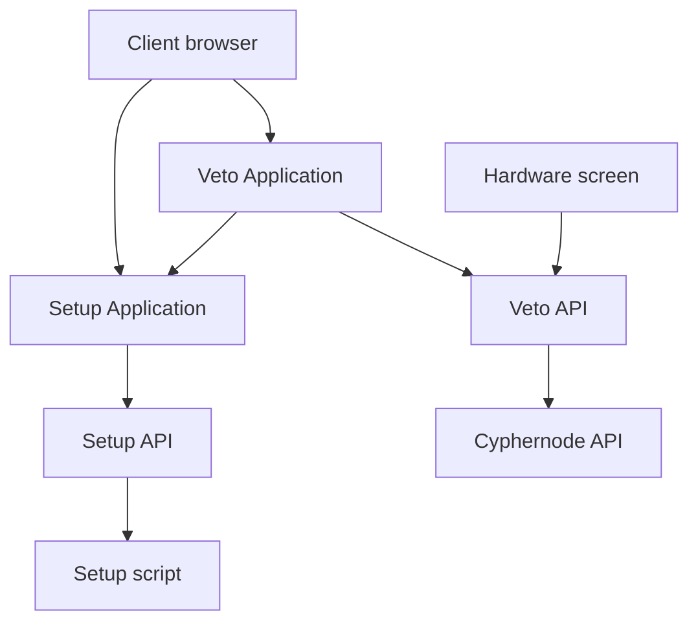

Architecture
===

## Key points
* Backend serve front-end as static content
* Aside from serving static context, the backend is purely an API

### Difference between dev & prod
#### Serving the front end
In dev, the front-end has its own server with `hot-reload` and `watch` capability. The backend serves it using a proxy.

In prod, the front-end is fully static. The backend statically serve theses files instead of using a proxy.

